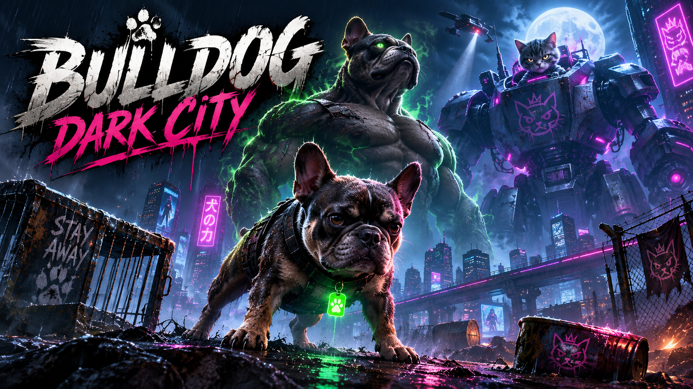

# Bulldog: Dark City



Browserbasiertes Phaser-Spiel mit Vite.

## Start

```bash
npm install
npm run dev
```

## Architektur

Die Struktur orientiert sich an
[`Little-Bolt-Big-Moon`](https://github.com/willidevac/Little-Bolt-Big-Moon):

- `classes/` – objektorientierte Spielbestandteile
- `js/` – Konfiguration, Levelaufbau, DOM-UI und Utilities
- `data/` – Level-, Upgrade- und Assetdaten
- `img/`, `audio/` – Medien
- `styles/` – getrennte CSS-Verantwortlichkeiten
- `docs/` – Planung und Nachweise

Details stehen in `docs/project-structure.md`.
