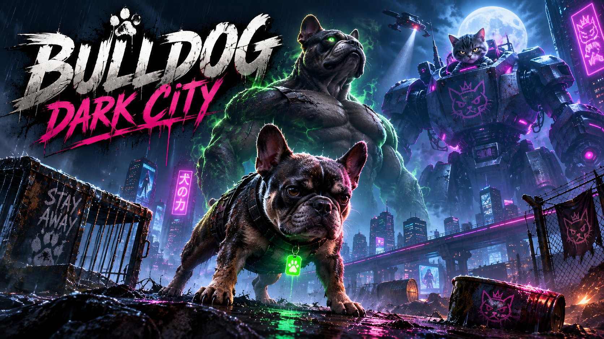

# 🐾 BULLDOG: DARK CITY



> **A cinematic 2D Action Platformer about survival, mutation and hope.**

## 🎮 Spielidee

**BULLDOG: DARK CITY** ist ein düsteres 2D-Jump-and-Run-Actionspiel, das in
einer heruntergekommenen Cyberpunk-Metropole spielt.

Der Spieler übernimmt die Kontrolle über eine französische Bulldogge, die
nach einem geheimen Experiment aus einem Forschungslabor entkommt.

Zwischen zerstörten Straßenzügen, Neonlichtern und verlassenen
Industrieanlagen kämpft sie sich durch eine feindliche Welt.

Doch ihr Ziel ist nicht Rache.

Sie sucht den Menschen, der ihr eines Tages ein Zuhause schenken wird – eine
Person, die sie noch nie getroffen hat.

## 🐶 Die Geschichte

Nach einem fehlgeschlagenen genetischen Experiment gelingt einer
französischen Bulldogge die Flucht aus einem geheimen Labor.

Die Stadt außerhalb ist längst verloren:

- mutierte Tiere
- Hundefänger
- verseuchte Nahrung
- mechanische Kreaturen

Überall lauern Gefahren.

Während ihrer Reise stößt die Bulldogge immer wieder auf Hinweise einer
geheimnisvollen Frau. Sie weiß nicht, wer diese Person ist. Sie weiß nur, dass
sie ihr folgen muss.

Am Ende ihrer Reise werden sich beide zum ersten Mal begegnen – nicht als
Besitzerin und Hund, sondern als zwei Überlebende.

Die Geschichte wird nahezu vollständig **ohne gesprochene Dialoge** erzählt.
Emotionen, Animationen, Musik, Umgebung und Zwischensequenzen übernehmen das
Storytelling.

## 🦴 Mutation

Die Bulldogge besitzt zwei verschiedene Zustände.

### Normaler Modus

- Fortbewegung auf vier Pfoten
- Laufen, Springen, Fallen und Landen
- Bissangriff am Boden und in der Luft
- Ruhe- und Atemanimation
- Treffer- und K.-o.-Animation

### Mutierter Modus

Zwei eingesammelte Serum-Items füllen die Serumleiste voll. Die Mutation wird
auf dem Desktop und in der Touch-Steuerung mit `M` ausgelöst.

Während der zeitlich begrenzten Mutation läuft die Bulldogge auf zwei Beinen
und erhält:

- eine eigene Lauf-, Sprung-, Lande- und Rückverwandlungsanimation
- abwechselnde linke und rechte Prankenangriffe
- Prankenangriffe auch während eines Sprungs
- Schutz vor den Angriffen normaler Gegner
- eine eigene Mutationsanzeige anstelle des normalen HUDs

Nach Ablauf der Mutationsenergie verwandelt sie sich automatisch zurück.

## ⚔️ Gegner

Im Vertical Slice umgesetzt:

- Hundefänger
- Sicherheitsdrohnen
- mutierte Katzen
- Roboterkatze als Endgegner

Für die weitere Entwicklung geplant:

- Elite-Hundefänger
- Roboter-Ratten
- vergiftete Futterautomaten
- weitere mutierte Kreaturen

## 👑 Endgegner

In Level 3 wartet eine große Roboterkatze in der Arena. Ihr Lebensbalken
besitzt **neun Trefferpunkte**, aufgeteilt in drei farbige Phasen mit jeweils
drei Treffern: Rot, Orange und Blau.

Die Roboterkatze patrouilliert durch die Arena, fliegt über Hindernisse und die
Bulldogge und feuert eine animierte Klauenattacke. Die Bulldogge greift im
Nahkampf oder mit eingesammelten Wurfknochen an. Nach dem letzten Treffer folgen
die Todesanimation, das Victoryvideo und der gemeinsame Endscreen.

## 🌆 Spielwelt

Die Welt besteht aus einer düsteren Cyberpunk-Stadt.

Geplante Gebiete:

- Forschungslabor
- Käfiggassen
- verlassene Industriegebiete
- Neon-Straßen
- Kanalisation
- Tiergefängnisse
- Cyber-Fabriken
- Hochhäuser
- Dächer
- Untergrund
- Endboss-Arena

Typische Hindernisse:

- Hundekäfige
- Elektrozäune
- Laser
- Förderbänder
- giftiges Wasser
- Müllpressen
- einstürzende Plattformen
- Lüftungsschächte

## 🎯 Gameplay

Der Fokus liegt auf einer Mischung aus:

- klassischem Jump-and-Run
- Action
- Erkundung
- Plattform-Passagen
- Bosskämpfen
- kleinen Rätseln
- Timing
- Transformationen

## 🚀 Features

Bereits im spielbaren Prototyp umgesetzt:

- 2D-Sidescroller mit Kamera- und Levelgrenzen
- animierte Bewegung, Sprung, Landung, Angriff und K. o.
- zeitlich begrenztes Mutationssystem mit eigener HUD-Anzeige
- sammelbare Münzen, Serum und Lebensenergie
- Hundefänger, mutierte Katzen, Drohnen und eine Roboterkatze
- Nahkampf, Lebenssystem, Trefferreaktionen und Gegnerbelohnungen
- Intro-, Game-over- und Victory-Videosequenzen mit Skip-Funktion
- Musik, situationsabhängige Soundeffekte und globales Mute-System
- drei verbundene Level mit übernommenem Spielerzustand
- gemeinsamer Endscreen für Sieg und Niederlage mit Neustart ohne Reload
- Maus-, Tastatur-, Gamepad- und responsive Touch-Steuerung
- Optionsdialog mit Spielerklärung sowie erreichbares Impressum
- Boss-Lebensphasen, Wurfknochen und animierte Klauenprojektile

Noch in Entwicklung oder geplant:

- Upgrade-System
- Checkpoints und dauerhafte Speicherstände
- zusätzliche Level und Gegnertypen
- Geheimräume und alternative Enden

### Steuerung

Desktop:

- `A` / `D` oder Pfeiltasten: Laufen
- `W`, Pfeil hoch oder Leertaste: Springen
- `F`, `J` oder linke Maustaste: Angreifen
- `M`: Mutation bei voller Serumleiste
- `K` / `L`: eingesammelten Wurfknochen verwenden
- `ESC`: zurück zum Hauptmenü
- Leertaste: Intro- und Victoryvideo überspringen

Auf unterstützten Tablets und Smartphones erscheinen im Querformat eigene
Touchfelder für Bewegung, Sprung, Angriff, Mutation und Wurfknochen. Im
Hochformat fordert eine Orientierungshilfe zum Drehen des Geräts auf. Laptop-
und Desktopauflösungen bleiben auch bei vorhandenem Touchscreen in der
Desktopansicht.

### Extras des Prototyps

- mehrschichtige Parallax-Hintergründe in drei Farbwelten
- fahrende Züge, Helikopter, bewegliche Plattformen und animierte Hindernisse
- Einsammel- und Splash-Animationen für Coins, Lebensenergie und Serum
- Gegnerbelohnungen sowie langsame Füllanimationen der Statusanzeigen
- gespeicherter globaler Mute-Zustand und Bildschirmmodus per LocalStorage
- sichere externe GitHub-Navigation und semantische rechtliche Navigation

## 💻 Technik

Das Projekt wird mit modernen Webtechnologien entwickelt.

- **Phaser 3 und HTML5 Canvas:** Darstellung, Spielschleife und Physik
- **Canvas-Einbindung:** In `index.html` dient `<main id="game">` als
  semantischer Spielcontainer. Phaser erzeugt und verwaltet das eigentliche
  `<canvas>` darin automatisch über die Einstellung `parent: 'game'`.
- **Objektorientiertes JavaScript:** Player, Gegner, Boss, Projektile,
  Plattformen, Level, UI und Animationen
- **JavaScript-Konfigurationen:** Leveldaten, Gegnerpositionen, Assets,
  Animationen und Balancing
- **Phaser-Szenen:** Hauptmenü, Level, Videoübergänge und Game-over-Ablauf
- **HTML und CSS:** semantische Seitenhülle und responsive Canvas-Einbettung
- **Szenenübergreifender Spielzustand:** Leben und Sammelobjekte werden beim
  Levelwechsel übernommen
- **LocalStorage:** speichert den globalen Mute-Zustand und den gewählten
  Bildschirmmodus dauerhaft; weitere Spielstände sind geplant
- **Vite:** lokaler Entwicklungsserver und Produktions-Build
- **Node-Test-Runner:** automatisierte Tests für zentrale Spiellogik

## 📂 Projektstruktur

Die grundlegende Architektur wurde vom Open-Source-Projekt
[`willidevac/Little-Bolt-Big-Moon`](https://github.com/willidevac/Little-Bolt-Big-Moon)
übernommen und für **BULLDOG: DARK CITY**, Phaser 3 und Vite angepasst.

```text
bulldog-dark-city/
├── classes/
│   ├── base/
│   ├── core/scenes/
│   ├── entities/
│   ├── environment/
│   ├── input/
│   ├── systems/
│   └── ui/
├── js/
│   ├── config/
│   ├── levels/
│   ├── ui/
│   └── utils/
├── data/
│   └── levels/
├── img/
│   ├── backgrounds/
│   ├── concepts/
│   ├── cover/
│   ├── fonts/
│   ├── images/
│   ├── sprites/
│   ├── tilesets/
│   └── ui/
├── audio/
├── fonts/
├── styles/
├── docs/
├── templates/
├── tests/
├── video/
├── index.html
├── style.css
├── script.js
├── vite.config.js
└── package.json
```

Weitere Architekturregeln stehen in
[`docs/project-structure.md`](docs/project-structure.md).

## 🤖 Assetdaten

### Bilder

Ein Großteil der Grafiken, Illustrationen, Konzeptbilder und visuellen Assets
wird mithilfe KI-generierter Bildmodelle erstellt und anschließend bei Bedarf
weiter angepasst oder überarbeitet.

### Audio

Musik, Soundeffekte und Sprachaufnahmen werden mithilfe von
Wondershare-Produkten erstellt, aufgenommen oder nachbearbeitet.

## 📈 Projektstatus

### Aktuelle Phase

**Spielbarer Gameplay-Prototyp / Vertical Slice**

Die grundlegenden Spielsysteme sind umgesetzt und werden schrittweise um neue
Level, Gegner, Animationen, Sounds und Balancing erweitert.

Aktueller Fortschritt:

- ✅ Grundidee, Spielgenre und Storykonzept entwickelt
- ✅ Phaser- und Vite-Grundarchitektur aufgebaut
- ✅ responsives Canvas und vollständiges Startmenü umgesetzt
- ✅ Tastatur-, Maus-, Touch- und vorbereitete Gamepad-Bedienung
- ✅ Level 1 mit Plattformen, Hundefänger, Items und Levelausgang
- ✅ Level 2 mit Katzen, Drohnen, Raketen, beweglichen Plattformen und Ausgang
- ✅ Level 3 mit Arenaumgebung, Hindernissen und Roboterkatzen-Boss
- ✅ Bewegung, Sprung, Landung, Angriff und Trefferreaktionen
- ✅ Mutationssystem mit zeitlicher Rückverwandlung
- ✅ Lebens-, Münz-, Serum- und Mutationsanzeigen
- ✅ Sammelobjekte, Belohnungen und Übernahme des Spielerzustands
- ✅ Intro-, Game-over-, Victory-, Musik- und Soundintegration
- ✅ Produktions-Build und FTP-taugliche Vite-Konfiguration
- ✅ Endboss, Boss-Lebensphasen und gemeinsamer Endscreen
- ✅ responsive Touch-Steuerung, globaler Mute-Zustand und Spielerklärung
- ⏳ Checkpoints, Speicherstände und Upgrade-System
- ⏳ weitere Level und vollständige Spielkampagne

## Installation und Start

Voraussetzung ist eine aktuelle Node.js-Version.

```bash
npm install
npm run dev
```

Automatisierte Projektprüfung:

```bash
npm test
```

Für einen Produktions-Build:

```bash
npm run build
```

## 🎯 Langfristiges Ziel

**BULLDOG: DARK CITY** soll ein atmosphärisches 2D-Action-Adventure werden,
das klassische Jump-and-Run-Mechaniken mit moderner Präsentation, emotionalem
Storytelling und einem einzigartigen Mutationssystem verbindet.

Unser Ziel ist es, ein Spiel zu entwickeln, das durch seinen Stil, seine
Charaktere und seine Welt langfristig im Gedächtnis bleibt.

## © Hinweis

Dieses Projekt befindet sich aktuell in Entwicklung.

Alle Konzepte, Designs und Spielmechaniken können sich während der Entwicklung
verändern oder erweitert werden.
